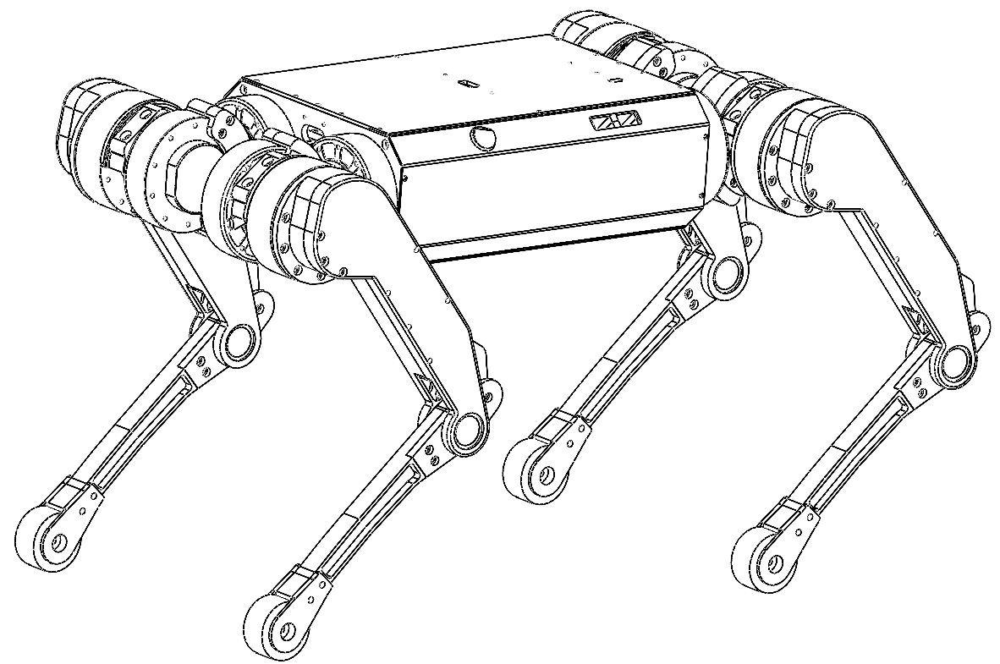
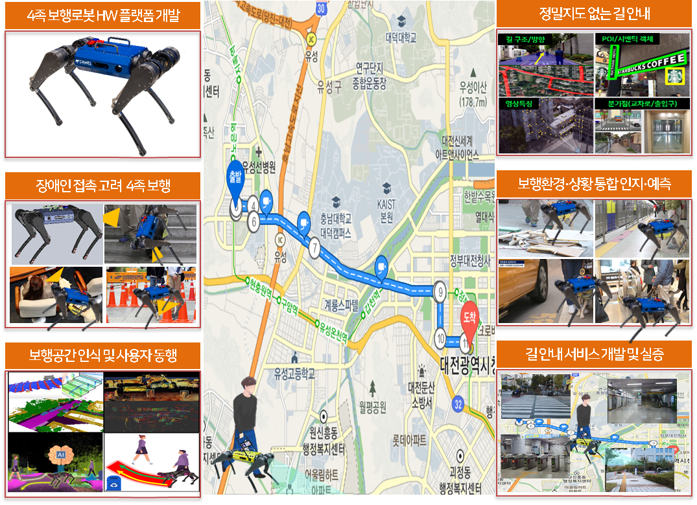
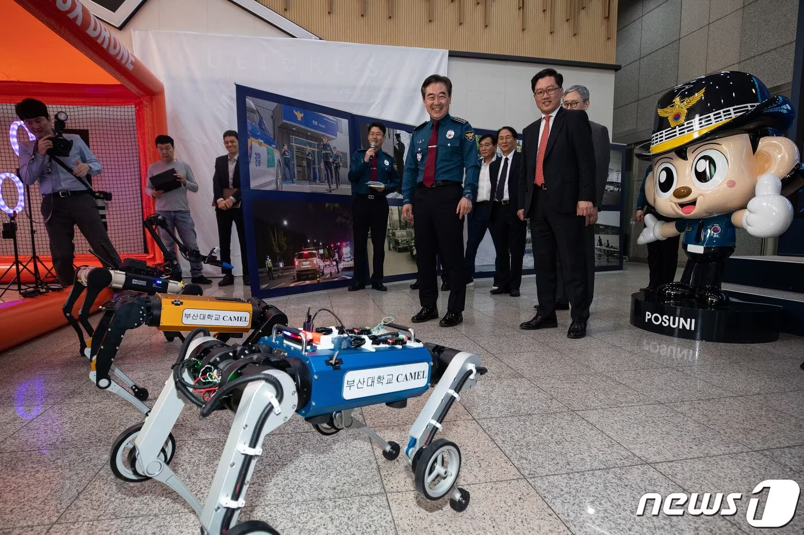
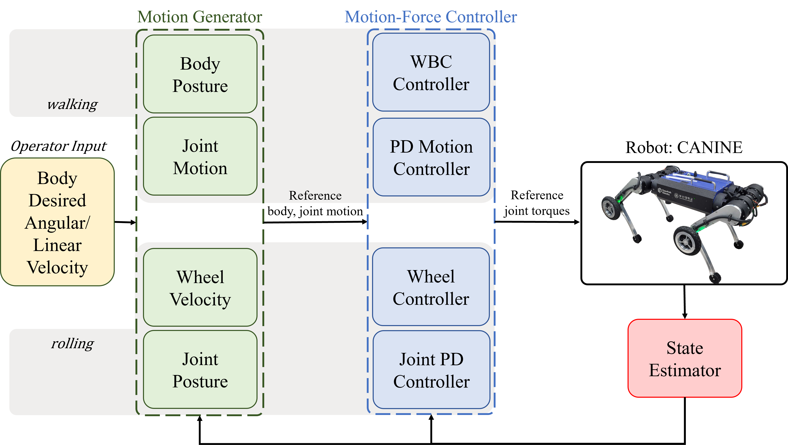

---
# Leave the homepage title empty to use the site title
title:
date: 2022-10-24
type: landing

sections:
  - block: hero
    content:
      title: |
        Computer 
        And 
        Machine 
        Engaged 
        Lab
      image:
        filename: canine/canine1.png
      text: |
         
        
        The **Computer and Machine Engaged Lab** has been a center of excellence for Physical Artificial Intelligence research, teaching, and practice since its founding in 2020.
  

  - block: markdown
    id: imitation-learning
    content:
      title: "Imitation Learning"
      subtitle: ""
      text: |
        

          

            <video width="100%" height="auto" controls autoplay muted loop preload="auto" style="max-width: 400px; border-radius: 8px;">
              <source src="videos/rby1_2.mp4" type="video/mp4">
              Your browser does not support the video tag.
            </video>
          

          

            <video width="100%" height="auto" controls autoplay muted loop preload="auto" style="max-width: 800px; border-radius: 8px;">
              <source src="videos/rby1_1.mp4" type="video/mp4">
              Your browser does not support the video tag.
            </video>
          

        

  - block: markdown
    id: perceptive-locomotion
    content:
      title: "Perceptive Locomotion"
      subtitle: ""
      text: |
        

          

            <video width="100%" height="auto" controls autoplay muted loop preload="auto" style="max-width: 800px; border-radius: 8px;">
              <source src="videos/perceptive_locomotion_1.mp4" type="video/mp4">
              Your browser does not support the video tag.
            </video>
          

        

  - block: markdown
    id: reinforcement-learning
    content:
      title: "Reinforcement Learning"
      subtitle: ""
      text: |
        

          

            <video width="100%" height="auto" controls autoplay muted loop preload="auto" style="max-width: 800px; border-radius: 8px;">
              <source src="videos/rl_walk_1.mp4" type="video/mp4">
              Your browser does not support the video tag.
            </video>
          

        

  - block: markdown
    content:
      title: ""
      subtitle: ""
      text: |
        

          

            
          

          

            
          

          

            
          

          

            
  

  # 첫 번째 슬라이더
  - block: slider
    content:
      slides:
        - title: ""
          content: ""
          align: center
          background:
            image:
              filename: canine/canine2.jpg
              fit: contain
              filters:
                brightness: 1.0
            position: center
        - title: ""
          content: ""
          align: center
          background:
            image:
              filename: canine/canine3.png
              fit: contain
              filters:
                brightness: 1.0
            position: center
    design:
      is_fullscreen: false
      slide_height: '60vh'
      interval: 4000
      loop: true
      css_style: "max-width: 1440px; margin-inline: auto;"

  # - block: slider
  #   content:
  #     slides:
  #       - title: "AI & ML"
  #         content: "Reinforcement Learning"
  #         align: center
  #         background:
  #           image:
  #             filename: lab_images/image22.png
  #           position: center
  #       - title: "Research Highlights"
  #         content: "Latest Publications"
  #         align: center
  #         background:
  #           image:
  #             filename: canine/canine2.jpg
  #             filters:
  #               brightness: 0.7
  #           position: center
  #         link:
  #           text: "See Publications"
  #           url: "/publication/"
  #   design:
  #     is_fullscreen: false
  #     slide_height: '60vh'
  #     interval: 4000
  #     loop: true
  #     css_style: "max-width: 100%; margin: 0;"

  # - block: slider
  #   content:
  #     slides:
  #       - title: "Welcome to the Lab"
  #         content: "3D Vision · Robotics · AI"
  #         align: center
  #         background:
  #           image:
  #             # 이미지 파일은 assets/media/ 에 두고 파일명만 적습니다.
  #             filename: canine/canine2.jpg
  #             # 필요 시 밝기/포지션 조절
  #             filters:
  #               brightness: 0.7
  #           position: center
  #       - title: "Research Highlights"
  #         content: "Locomotion / Perception / Reinforcement Learning"
  #         align: center
  #         background:
  #           image:
  #             filename: canine/canine3.png
  #             filters:
  #               brightness: 0.6
  #           position: right
  #         link:
  #           text: "See Publications"
  #           url: "/publication/"
  #       - title: ""
  #         align: center
  #         background:
  #           image:
  #             filename: lab_images/image22.png
  #           position: center
  #   design:
  #     is_fullscreen: false
  #     slide_height: '80vh'
  #     # slide_width: '100vh'
  #     interval: 5000
  #     loop: true
  #     css_style: "max-width: 1440px; margin-inline: auto;"
    
      
  - block: markdown
    id: section-1
    content:
      title: Section 1
      subtitle: A subtitle
      text: Add any **markdown** formatted content here - text, images, videos, galleries - and even HTML code!
  
  - block: collection
    content:
      title: Latest News
      subtitle:
      text:
      count: 5
      filters:
        author: ''
        category: ''
        exclude_featured: false
        publication_type: ''
        tag: ''
      offset: 0
      order: desc
      page_type: post
    design:
      view: card
      columns: '1'
  
  # - block: markdown
  #   content:
  #     title:
  #     subtitle: ''
  #     text:
  #   design:
  #     columns: '1'
  #     background:
  #       image: 
  #         filename: coders.jpg
  #         filters:
  #           brightness: 1
  #         parallax: false
  #         position: center
  #         size: cover
  #         text_color_light: true
  #     spacing:
  #       padding: ['20px', '0', '20px', '0']
  #     css_class: fullscreen

  # - block: collection
  #   content:
  #     title: Latest Preprints
  #     text: ""
  #     count: 5
  #     filters:
  #       folders:
  #         - publication
  #       publication_type: 'article'
  #   design:
  #     view: citation
  #     columns: '1'

  # - block: markdown
  #   content:
  #     title:
  #     subtitle:
  #     text: |
  #       {}
  #   design:
  #     columns: '1'
---
